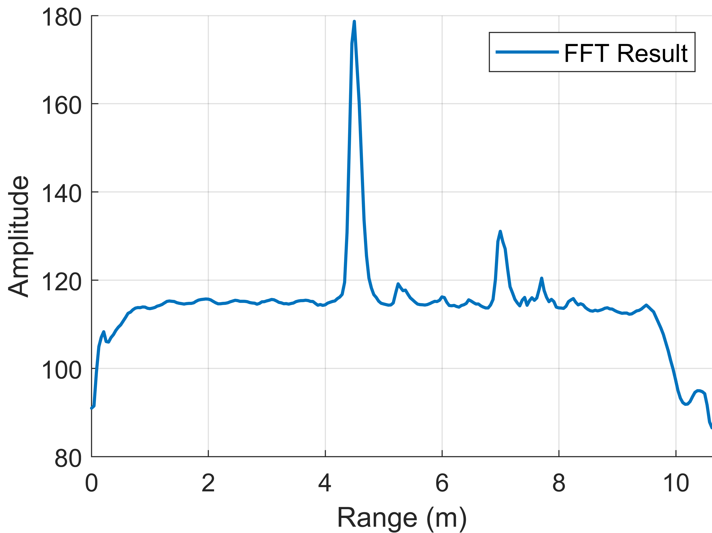
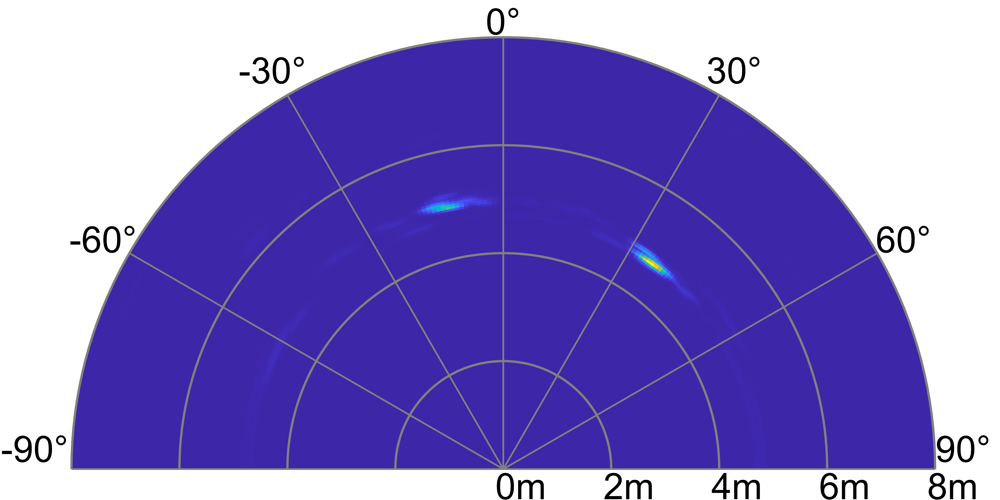

# mmWaveMatlab-Demo
Introduction and demos of the mmWaveMatlab project.

#### Auhor: Hankai Liu
#### Organization: Tianjin University
#### Email: hkliu@tju.edu.cn
---
## Introduction
mmWaveMatlab is a Matlab codebase for millimeter wave radar signal processing and human sensing. This document will introduce some of the main features of mmWaveMatlab and show the corresponding results.

---

## Basic Signal Processing
Provide basic range, velocity, and angle measurements.

### Range Measurement
Perform Range FFT to obtain range spectrums.

### Velocity Measurement
1. Perform Doppler FFT to obtain RD maps.

3. Compute micro-Doppler spectrums. Support simultaneous observation of multiple targets through range/RA extraction.

### Angle Measurement
1. Configure the antenna array and perform angle estimation algorithms (FFT or digital beamforming) to obtain RA maps. Digital beamforming supports CBF and Capon algorithms and provides signal reconstruction.

2. Perform 2D angle estimation and accumulate signal strength for human imaging.

---

## Point Cloud Processing
Provide point cloud-related functions.

### Range/RD/RA Point Cloud Generation 
Perform 1D/2D CFAR in range spectrum, RD Map, and RA map to generate point clouds.

$~~~~$

### 4D Point Cloud Generation 
Generate 4D point clouds through approaches of 4D FFT (RD point cloud -> 2D Angle FFT) or 2-Pass DBF (RA point cloud -> elevation estimation & signal reconstruction -> Doppler FFT).

### Point Cloud Clustering 
1. Cluster 2D/3D point clouds of different types through DBSCAN.

   

3. Distinguish nearby targets through GMM clustering.

---

## Sensing
Provide various human sensing functions.

### Multi-person Tracking
A multi-person tracking solution with full process optimization involving detection enhancement, interference suppression, continuity maintenance, and trajectory correction. It can be used in conjunction with IMUs to identify users [1].

$~~~~$

$~~~~$

### Respiration Monitoring
Perform respiration monitoring on static targets. Support simultaneous observation of multiple targets through range/RA extraction.

---

## Our Research
Welcome to our research on mmWave radar, and feel free to contact us.

[1] "PmTrack: Enabling personalized mmWave-based human tracking," ACM IMWUT, 2023. (Multi-person tracking and identification)

[2] "Application-oriented privacy filter for mmWave radar," IEEE Communications Magazine, 2023. (Behavior privacy protection)

[3] "PosMonitor: Fine-grained sleep posture recognition with mmWave radar," IEEE Internet of Things Journal, 2024. (Sleep posture recognition)

[4] "VibCamera: mmWave and camera fusion for multi-point vibration monitoring", IEEE ICPADS, 2023. (Vibration measurement)
